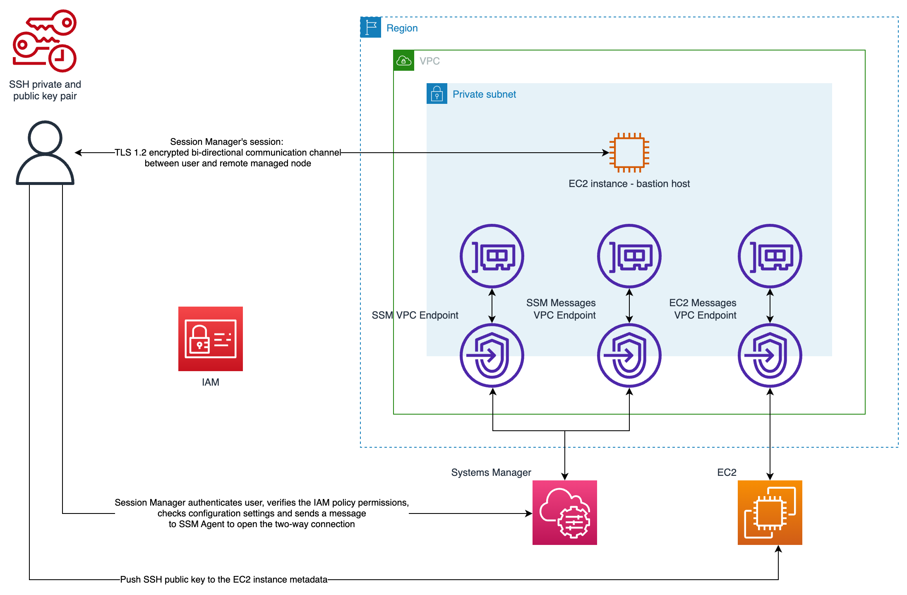

# Use the combination of AWS Systems Manager Session Manager and Amazon EC2 Instance Connect for Amazon EC2 bastion host access
```
Copyright Amazon.com, Inc. or its affiliates. All Rights Reserved.
SPDX-License-Identifier: MIT-0
```
## Summary

A bastion host, sometimes called “jump box”, is a server which provides a single point access from an external network
to the resources located in a private network. A server exposed to the external public network (ex. Internet) poses a
potential security risk of an unauthorized access. Special attention needs to be put on securing and controlling access
to such server.

This pattern presents how you can use the combination
of [AWS Systems Manager Session Manager](https://docs.aws.amazon.com/systems-manager/latest/userguide/session-manager.html)
and [Amazon EC2 Instance Connect](https://docs.aws.amazon.com/AWSEC2/latest/UserGuide/Connect-using-EC2-Instance-Connect.html)
to securely connect to an [Amazon Elastic Compute Cloud (Amazon EC2)](https://aws.amazon.com/ec2/) bastion host
deployed in your AWS account. The direct benefit of using this pattern is that the deployed bastion host has **no open
inbound ports exposed to the public Internet**. This limits the potential attack surface. Another benefit is that **you
don’t need to store and maintain long-lived SSH keys** in your AWS account. Instead, each user can use their own freshly
generated SSH keys each time they connect to the bastion host. The access to the bastion host is controlled by [AWS
Identity and Access Management (IAM)](https://aws.amazon.com/iam/) policies attached to user’s AWS credentials.

## Prerequisites and limitations

### Assumed knowledge

To get the most out of this pattern it requires reader to have a basic understanding
of [Amazon Elastic Compute Cloud (Amazon EC2)](https://aws.amazon.com/ec2/), [Amazon Virtual Private Cloud (VPC)](https://aws.amazon.com/vpc/)
and [Terraform](https://www.terraform.io/).

### Prerequisites

- An active AWS account
- [AWS Command Line Interface (AWS CLI)](https://docs.aws.amazon.com/cli/latest/userguide/install-cliv2.html) version 2,
  installed
- [Session Manager plugin for the AWS CLI](https://docs.aws.amazon.com/systems-manager/latest/userguide/session-manager-working-with-install-plugin.html)
  , installed
- [Terraform CLI](https://www.terraform.io/), installed
- SSH client, installed

### Limitations

- This pattern is intended as a proof of concept (PoC), or as a basis for further development. It should not be used in
  its current form in production deployments. Make sure to adjust presented example code to your needs and adapt it to
  your use case before deployment.

- Presented pattern assumes that the target bastion host uses Amazon Linux 2 operating system. While it is possible to
  use other Amazon Machine Images (AMI) it is out of scope for this document.

- We place bastion host in a private subnet without NAT Gateway and without route to Internet Gateway. This by
  design isolates EC2 instance from the public Internet. You can allow it to communicate with Internet by adding a
  specific network configuration.
  See [the documentation](https://docs.aws.amazon.com/vpc/latest/userguide/extend-intro.html) for details. Similarly,
  following least privilege principle, bastion host does not have access to any other resources in your AWS account
  unless explicitly granted permission.
  Refer to [the documentation](https://docs.aws.amazon.com/IAM/latest/UserGuide/introduction.html) for details.

- Each time this pattern is deployed it uses the most recent version of Amazon Machine Image (AMI) with Amazon Linux 2
  operating system. Using most recent version have few consequences you should keep in mind. EC2 instance is replaced by
  Terraform each time new version of AMI is detected during deployment. This means that new version of operating system
  with new patches and upgrades is going to be deployed. While the deployment in many cases might happen quite often, it
  is equally possible it won’t for a long time. From the security perspective it is important to frequently update and
  apply security patches to deployed EC2 instances. Refer
  to [the AWS documentation](https://docs.aws.amazon.com/AWSEC2/latest/UserGuide/update-management.html) to learn more.

- As this pattern is PoC and for the sake of simplicity we are using AWS managed IAM policies (ex.
  `AmazonSSMManagedInstanceCore`). AWS managed IAM policies cover common use cases and don't grant the least privilege
  permissions.
  Following [IAM security best practices](https://docs.aws.amazon.com/IAM/latest/UserGuide/best-practices.html#bp-use-aws-defined-policies)
  it is recommended to use the custom-made IAM policies that are most restrictive and grant only minimal required
  permissions.

### Product versions

- AWS CLI version 2
- Terraform v1.3.9

## Architecture

### Target technology stack

- VPC with single private subnet
- 3 VPC (Interface) Endpoints with corresponding security groups and security group rules
- EC2 instance (t3.nano) with Amazon Linux 2 installed with associated:
    - IAM role
    - IAM instance profile
    - security group

### Target architecture


We deploy single isolated EC2 instance (t3.nano) with Amazon Linux 2 installed inside of the private subnet in created
VPC. Instance does not expose any ports and does not have public IP assigned. It is fully isolated from the Internet and
uses VPC (Interface) Endpoints to communicate with AWS services (Systems Manager and EC2). You are going to assume an
IAM role with associated IAM policies that grant you required privileges to authenticate, authorize and connect to EC2
instance.
Following [the least privilege principle](https://docs.aws.amazon.com/IAM/latest/UserGuide/best-practices.html#grant-least-privilege),
created EC2 instance does not have access to other resources in your AWS account. You have to explicitly grant it by
assigning IAM policies to IAM role used by EC2 instance.

### Automation and scale

This pattern can be adopted to be a part of a larger infrastructure code and deployed in an automated way using CI/CD
tools. You can modify the code to change the type of deployed EC2 instance to adjust its parameters to your specific
needs. You can also adapt the code to deploy multiple instances by adding `count` meta-argument to `aws_instance`
resource in bastion host definition (`bastion-host/main.tf` file). For details refer
to [Terraform documentation](https://developer.hashicorp.com/terraform/language/meta-arguments/count).

## Tools

### Tools

- [AWS Command Line Interface (AWS CLI)](https://docs.aws.amazon.com/cli/latest/userguide/install-cliv2.html) version 2
- [Session Manager plugin for the AWS CLI](https://docs.aws.amazon.com/systems-manager/latest/userguide/session-manager-working-with-install-plugin.html)
- [Terraform CLI](https://www.terraform.io/)

## Best practices

- We recommend using automated code scanning tools to improve security and quality of the code. This pattern was scanned
  using [Checkov](https://www.checkov.io/) - a static code analysis tool for infrastructure-as-code. It scans cloud
  infrastructure code defined using Terraform, CloudFormation, Kubernetes, Helm, ARM Templates and Serverless framework
  platforms and detects security and compliance misconfigurations.
- Additionally, we recommend at minimum to perform basic validation and formatting checks using `terraform validate`
  and `terraform fmt -check -recursive` Terraform commands.
- It’s a good practice to add automated tests for infrastructure code. You can refer to this Terraform Blog post to
  learn more about different approaches to testing Terraform code.

## Epics

### Deployment

#### (First deployment only) 0. Initialize Terraform working directory

In this pattern we are
using [S3 Terraform backend](https://developer.hashicorp.com/terraform/language/settings/backends/s3). In order for the
deployment to work you need to create or use an existing S3 bucket to hold Terraform state.
Follow [the documentation on how to create S3 bucket](https://docs.aws.amazon.com/AmazonS3/latest/userguide/create-bucket-overview.html).
Once you have the bucket name you have 2 options.

**Option 1:**

Run below commend in the root directory of the pattern:

```shell
terraform init -backend-config="bucket=$S3_STATE_BUCKET" -backend-config="key=$PATH_TO_STATE_FILE" -backend-config="region=$AWS_REGION"
```

**Option 2:**

Modify source code in `config.tf` to include S3 bucket name, key and AWS region. Refer to Terraform documentation for
details.

```terraform
terraform {
  backend "s3" {
    bucket = $S3_STATE_BUCKET
  key = $PATH_TO_STATE_FILE
region = $AWS_REGION
}
...
}
```

Be sure to replace variables in above scripts with corresponding values:

- `$S3_STATE_BUCKET` is the name of S3 bucket holding Terraform state
- `$PATH_TO_STATE_FILE` is the key to the Terraform state file, for example: `infra/bastion-host/tarraform.tfstate`
- `$AWS_REGION` is the AWS region where your S3 bucket is deployed
  </br></br>

#### 1. Deploy resources

In order to start deployment run below commend in the root directory of the pattern:

```shell
terraform apply -var-file="dev.tfvars"
```

You will see a list of all the changes that are going to be applied to your AWS account and a prompt to confirm
deployment. Confirm and wait until all resources are deployed.

### Setup local environment

#### 1. Install tools

Follow [Prerequisites](#prerequisites) section to install AWS CLI and Session Manager plugin.
</br></br>

#### 2. Configure SSH connection

Follow [the documentation](https://docs.aws.amazon.com/systems-manager/latest/userguide/session-manager-getting-started-enable-ssh-connections.html#ssh-connections-enable)
to update the SSH configuration file to allow SSH connections through Session Manager.
It allows running a proxy command that starts a Session Manager session and transfer all data through opened connection.
</br></br>

#### 3. Generate SSH keys

Generate local SSH private and public keys. For example, you can use following command:

```shell
ssh-keygen -t rsa -f my_key
```

It will generate private and public SSH key pair which are going to be used to connect to bastion host.
It is recommended to provide password to protect access to keys and store keys in secure location.

### Connect to bastion host

#### 1. Get instance id

In order to connect to deployed bastion host you will need to obtain EC2 instance id. There are multiple ways you can do
that. For example you can get it using AWS console by navigating
to [EC2 dashboard](https://eu-central-1.console.aws.amazon.com/ec2/home) or through AWS CLI using:

```shell
aws ec2 describe-instances
```

To further filter results you can use following command:

```shell
aws ec2 describe-instances --filters 'Name=tag:Name,Values=$BASTION_HOST_TAG'  --output text --query 'Reservations[*].Instances[*].InstanceId' --output text
```

Replace `$BASTION_HOST_TAG` with tag used to mark bastion host. Default value is `sandbox-dev-bastion-host`.
Copy obtained EC2 instance id for later use.
</br></br>

#### 2. Send SSH keys

In order to connect to the bastion host we first have to send SSH key to the host using EC2 Instance Connect.
Use following command replacing `$INSTANCE_ID` with EC2 instance id obtained in previous step and `$PUBLIC_KEY_FILE`
with path to your public key file (for example: `my_key.pub`).

**Be sure to use public key and NOT private key.**

```shell
aws ec2-instance-connect send-ssh-public-key --instance-id $INSTANCE_ID --instance-os-user ec2-user --ssh-public-key file://$PUBLIC_KEY_FILE
```

You should receive message indicated successful upload of key. You have just uploaded temporary SSH key
to [EC2 instance metadata](https://docs.aws.amazon.com/AWSEC2/latest/UserGuide/ec2-instance-metadata.html) where it’s
going to remain for 60 seconds. After 60 seconds SSH key gets removed automatically, and you won’t be able to use it to
connect to the instance. You will see “Permission denied” error if you try. If this happens you can resend the key using
the same command.

This means that you have 60 seconds to initialize SSH connection after you upload keys. Follow next step to do so.
</br></br>

#### 3. Connect using SSH through Sessions Manager

In this last step you will connect to your bastion host using SSH. Use following command replacing
`$PRIVATE_KEY_FILE` with path to your private key (for example: my_key) and `$INSTANCE_ID` with EC2 instance id obtained
in
previous steps.

```shell
ssh -i $PRIVATE_KEY_FILE ec2-user@$INSTANCE_ID
```

Confirm connection by typing yes. It will open SSH connection using previously configured Session Manager.
You’re in!
</br></br>

#### (OPTIONAL) 4. Use other SSH options to open connection

It is possible to use different options to open connection to bastion host. For example you can use -D 8888 option to
open SSH connection with a local “dynamic” application-level port forwarding through 8888 port.
See [this link](https://explainshell.com/explain?cmd=ssh+-i+%24PRIVATE_KEY_FILE+-D+8888+ec2-user%40%24INSTANCE_ID) for
detailed explanation.

```shell
ssh -i $PRIVATE_KEY_FILE -D 8888 ec2-user@$INSTANCE_ID
```

This is kind of connection opens SOCKS proxy you can use for example to forward traffic from your local browser through
bastion host. Refer to man pages of ssh command to see all options.
</br></br>

#### (OPTIONAL) 5. Remove deployed resources

In order to remove all deployed resources run the following command from the root directory of this pattern:

```shell
terraform destroy -var-file="dev.tfvars"
```

and confirm removal of resources.
</br></br>

#### (OPTIONAL) 6. Connect to bastion host using script

Instead of manually executing steps described above, you can use provided [connect.sh](connect.sh) script. It will
generate set of SSH keys, push them to EC2 instance and initiate connection with the host. Execute the script and pass
tag and key name as arguments. Follow the prompt to connect to your bastion host. Example:

```shell
./connect.sh sandbox-dev-bastion-host my_key
```

## Troubleshooting
Sometimes you might experience `TargetNotConnected` error when trying to connect to the bastion host.

Solution:
1. Follow [Reboot your instance](https://docs.aws.amazon.com/AWSEC2/latest/UserGuide/ec2-instance-reboot.html) AWS documentation to reboot deployed bastion host.
2. Follow [Connect to the bastion host](#connect-to-bastion-host) section of this document and try to connect again

## Related resources

- https://docs.aws.amazon.com/systems-manager/latest/userguide/session-manager.html
- https://docs.aws.amazon.com/systems-manager/latest/userguide/session-manager-working-with-install-plugin.html
- https://docs.aws.amazon.com/systems-manager/latest/userguide/session-manager-getting-started-enable-ssh-connections.html#ssh-connections-enable
- https://docs.aws.amazon.com/AWSEC2/latest/UserGuide/Connect-using-EC2-Instance-Connect.html
- https://docs.aws.amazon.com/AWSEC2/latest/UserGuide/ec2-instance-connect-methods.html#connect-options
- https://docs.aws.amazon.com/AWSEC2/latest/UserGuide/security-iam.html
- https://docs.aws.amazon.com/IAM/latest/UserGuide/id_roles_use_switch-role-ec2.html
- https://docs.aws.amazon.com/IAM/latest/UserGuide/best-practices.html
- https://docs.aws.amazon.com/vpc/latest/userguide/vpc-security-groups.html
- https://developer.hashicorp.com/terraform
- https://www.hashicorp.com/blog/testing-hashicorp-terraform
- https://developer.hashicorp.com/terraform/cli/commands/validate
- https://developer.hashicorp.com/terraform/cli/commands/fmt
- https://www.checkov.io/

## Additional information

### Logging and monitoring

Logging and monitoring are important parts of maintaining systems both from the operational and security perspectives.
There are multiple ways in which you can monitor connections and activity in your bastion host. Below you can find some
of the resources from AWS documentation that are related to this topic:

- [Monitoring AWS Systems Manager](https://docs.aws.amazon.com/systems-manager/latest/userguide/monitoring.html)

- [Logging and monitoring in AWS Systems Manager](https://docs.aws.amazon.com/systems-manager/latest/userguide/logging-and-monitoring.html)

- [Auditing session activity](https://docs.aws.amazon.com/systems-manager/latest/userguide/session-manager-auditing.html)

- [Logging session activity](https://docs.aws.amazon.com/systems-manager/latest/userguide/session-manager-logging.html)
